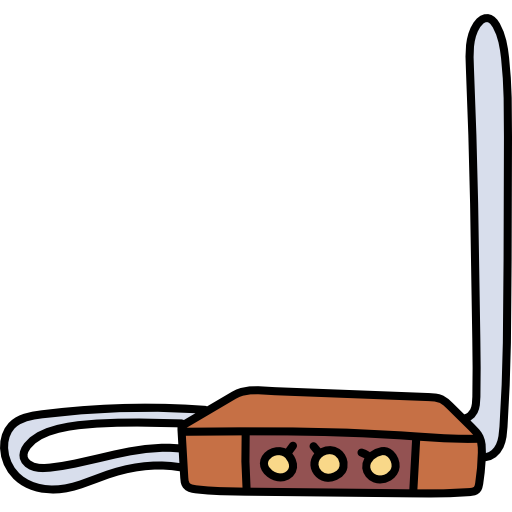

<h1 align="center">
  <br>
  <a href="#"></a>
  <br>
  Teremim
  <br>
</h1>

Um teremin simples usando uma placa de desenvolvimento `Arduino`, um sensor de distância `HC-SR04` e um `Buzzer`.

## Montagem

Apenas monte o circuito como no esquemático abaixo:


E aqui está a montagem do circuito:


Tenha atenção aos pinos, como mostra o código a seguir: ECHO = 6, TRIGGER = 7 e BUZZER = 2

## Código

O código está disponível [aqui](teremim/teremim.ino) também.

```c++
#include "Ultrasonic.h" 
const int echoPin = 6; 
const int trigPin = 7;
const int buzzer = 2;

Ultrasonic ultrasonic(trigPin,echoPin); 

int distancia; 
String result;

void setup(){
  pinMode(echoPin, INPUT); 
  pinMode(trigPin, OUTPUT); 
  pinMode(buzzer, OUTPUT);
  Serial.begin(9600);
}
 
void loop(){
  hcsr04(); 
  Serial.print("Distancia "); 
  Serial.print(result); 
  Serial.println("cm");
  tone(buzzer, 500+20*result.toInt());
}

void hcsr04() {
    digitalWrite(trigPin, LOW); 
    delayMicroseconds(2); 
    digitalWrite(trigPin, HIGH); 
    delayMicroseconds(10); 
    digitalWrite(trigPin, LOW); 
    distancia = (ultrasonic.Ranging(CM)); 
    result = String(distancia); 
    delay(10);
 }
```

Note que é necessário uma biblioteca `Ultrasonic.h` que você pode achar [aqui](Ultrasonic.zip), para adicionar ela na IDE do Arduino, siga os passos encontrados [aqui](https://github.com/PETEletricaUFBA/automacao-iot-nodemcu/tree/master/M%C3%B3dulo%202/Sensores/3.%20Sensor%20de%20dist%C3%A2ncia#o-c%C3%B3digo-do-circuito)

## Contribuir
Contribuições são o que tornam a comunidade de código aberto um lugar incrível para aprender, inspirar e criar. Todas as contribuições que você fizer são muito bem vindas, sinta-se a vontade!

## Licença
Licença - [MIT](https://github.com/taffarel55/FlappyBird/blob/master/LICENSE)
